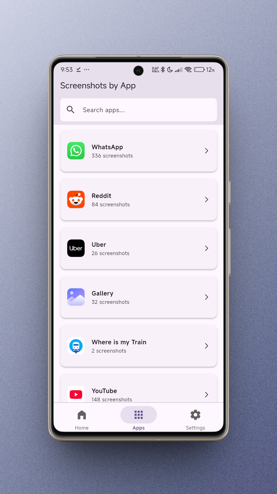
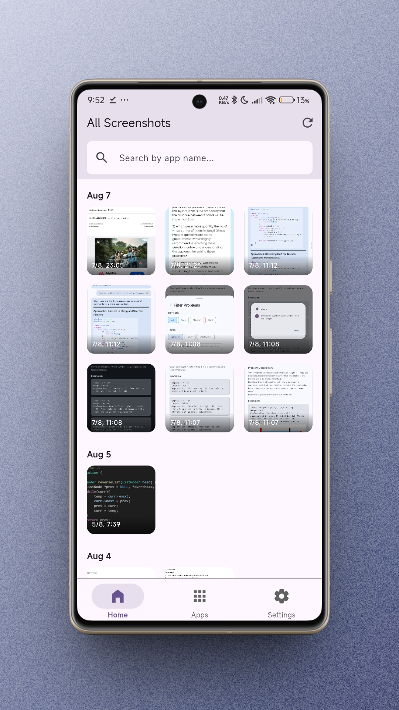
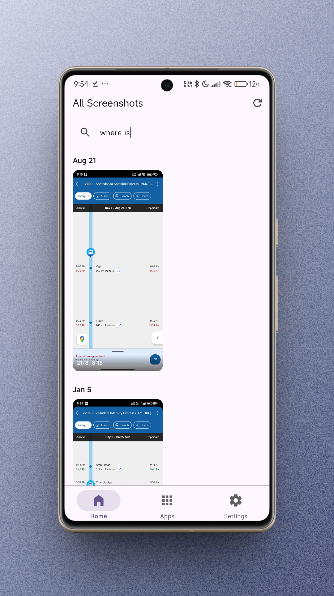
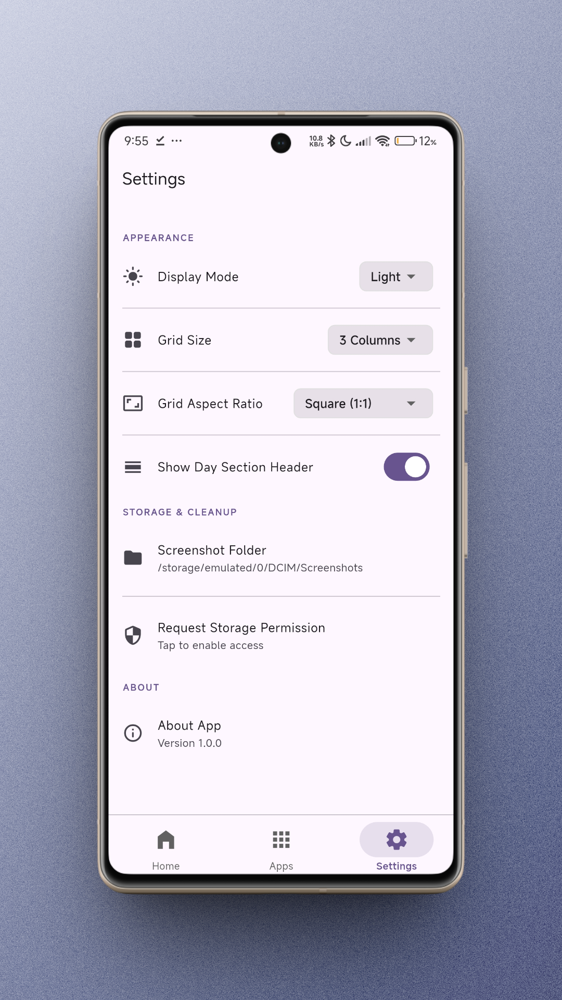
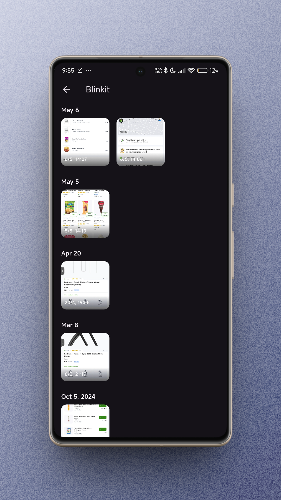

# SmartSS


---

## Description

A smart screenshot manager app that automatically organizes and filters your screenshots by app, making it easy to find what you need.

---

## Overview

SmartSS is your go-to app for keeping screenshots organized without the hassle. It automatically groups and filters screenshots by the app they came from, so you can quickly find what you’re looking for. The app uses a Flutter MethodChannel in Kotlin to let Dart access Android app info and icons, making everything look and feel native. You can tweak grid layouts, switch display modes, etc. Built with Flutter and Dart, SmartSS is all about making screenshot management smarter and easier.

---

## Getting Started

To run this project locally:

1. **Install Flutter:** [Flutter installation guide](https://docs.flutter.dev/get-started/install)
2. **Clone the repository:**
	```sh
	git clone https://github.com/neenza/smartss.git
	cd smartss
	```
3. **Install dependencies:**
	```sh
	flutter pub get
	```
4. **Run the app:**
	```sh
	flutter run
	```

---


---

## Screenshots

<p align="center">
	
	
	
	
	
</p>

---

## Resources

- [Lab: Write your first Flutter app](https://docs.flutter.dev/get-started/codelab)
- [Cookbook: Useful Flutter samples](https://docs.flutter.dev/cookbook)
- [Flutter Documentation](https://docs.flutter.dev/)
